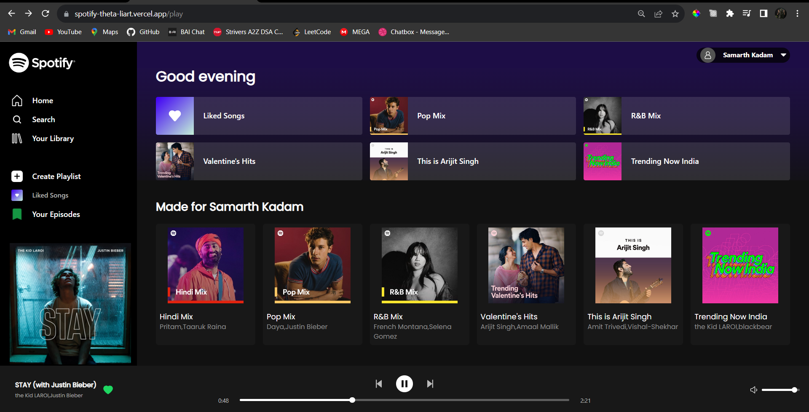

# Spotify
 Spotify Clone - Full Stack Music Streaming
 
Welcome to the Spotify Clone project, an immersive full-stack music streaming

## 🖥️ Tech Stack

**Frontend:**

&nbsp;
&nbsp;
&nbsp;
&nbsp;

**Backend:**

&nbsp;
&nbsp;
&nbsp;
&nbsp;

**Design:**

